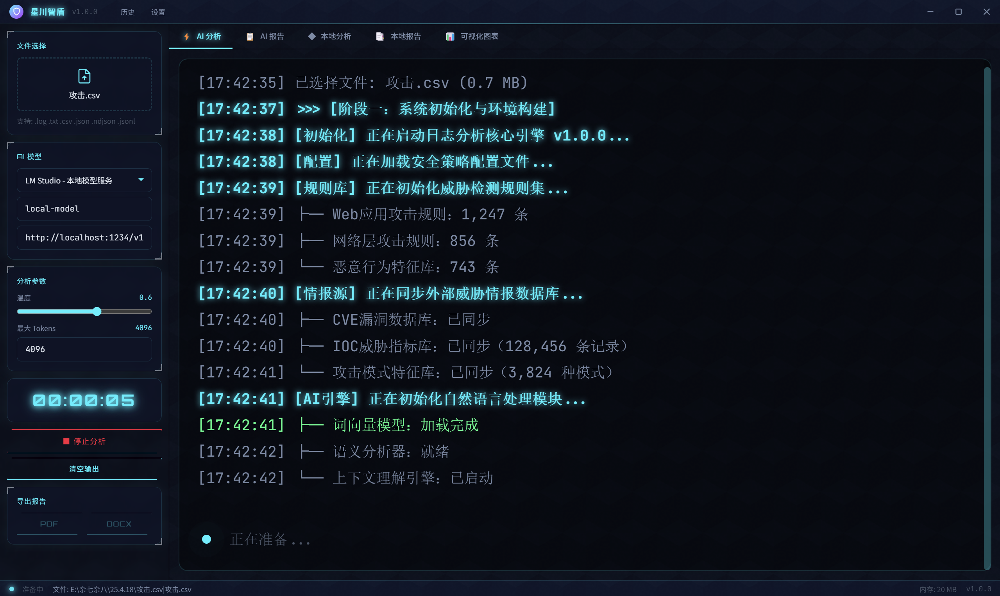

<div align="center">

```
╔══════════════════════════════════════════════════════════════╗
║                                                              ║
║   ███████╗██╗  ██╗ ██████╗██╗  ██╗██╗   ██╗ █████╗ ███╗   ██╗║
║   ╚══██╔╝╚██╗██╔╝██╔════╝██║  ██║██║   ██║██╔══██╗████╗  ██║║
║      ██╔╝  ╚███╔╝ ██║     ███████║██║   ██║███████║██╔██╗ ██║║
║     ██╔╝   ██╔██╗ ██║     ██╔══██║██║   ██║██╔══██║██║╚██╗██║║
║    ███████╗██╔╝ ██╗╚██████╗██║  ██║╚██████╔╝██║  ██║██║ ╚████║║
║    ╚══════╝╚═╝  ╚═╝ ╚═════╝╚═╝  ╚═╝ ╚═════╝╚═╝  ╚═╝╚═╝  ╚═══╝║
║                    Z H I D U N                                ║
╚══════════════════════════════════════════════════════════════╝
```

# 星川智盾 `ZhiDun`

**AI 驱动的网站日志安全分析系统**


<br/>

**双引擎驱动** — AI 智能分析 + 本地规则引擎，深度检测网站日志中的安全威胁

**8 大 AI 平台** — DeepSeek / 通义千问 / 智谱 / Kimi / 文心 / Ollama / LM Studio / OpenAI

**95 条安全规则** — 覆盖 OWASP Top 10，检测 SQL 注入、XSS、SSRF、WebShell 等 18 类攻击

</div>

---

## 功能全景

<table>
<tr>
<td width="50%">

### 分析引擎

- **AI 智能分析** — 深度语义理解，生成专业安全报告
- **本地规则引擎** — 95 条 OWASP/CRS 规则，离线可用
- **双模式独立** — AI 与本地分析互不干扰，独立报告
- **分析中途停止** — AbortController 立即中断请求

</td>
<td width="50%">

### 可视化 & 导出

- **ECharts 科技感图表** — 攻击分布 / 风险统计 / 时间线
- **DOCX 报告导出** — 专业 Word 模板，彩色风险标签
- **PDF 报告导出** — 完美中文渲染，自动分页
- **7 种赛博朋克主题** — Cyber 青 / 能量紫 / 矩阵绿 ...

</td>
</tr>
</table>

---

## 截图预览

<div align="center">

### 开屏界面


### AI 分析过程


### AI 安全分析报告


### 本地规则分析


### 本地分析报告


### 可视化图表


</div>

---

## 快速开始

### 环境要求

| 依赖 | 版本 |
|:---:|:---:|
| Node.js | >= 18 |
| npm | >= 9 |

### 安装 & 运行

```bash
# 克隆项目
git clone https://github.com/chu0119/zhidun.git
cd zhidun

# 安装依赖
npm install

# 启动开发模式
npm run dev
```

### 构建打包

```bash
# 构建 Electron 应用
npm run build
```

构建产物位于 `release/` 目录，Windows 平台生成 NSIS 安装包。

---

## 使用指南

```
  ┌─────────────────────────────────────────────────────────┐
  │  1. 选择日志文件  →  .log .txt .csv .json .ndjson       │
  │  2. 配置 AI 模型  →  选择提供商，填入 API Key（可选）   │
  │  3. 开始分析                                            │
  │     ├── AI 分析    →  深度语义分析，生成详细报告        │
  │     └── 本地分析   →  95 条规则离线检测，即时出结果     │
  │  4. 查看报告      →  自动跳转到对应报告页面             │
  │  5. 导出报告      →  DOCX / PDF 两种格式                │
  └─────────────────────────────────────────────────────────┘
```

### 示例数据

项目提供示例日志文件 `samples/sample-access.log`，包含：

| 攻击类型 | 示例 |
|----------|------|
| SQL 注入 | UNION 注入、盲注、时间盲注 |
| XSS 攻击 | 反射型、DOM 型、SVG |
| 目录遍历 | `../../etc/passwd` |
| 暴力破解 | Hydra、字典攻击 |
| SSRF 攻击 | 内网元数据、file:// 协议 |
| WebShell | 蚁剑、一句话木马 |
| 扫描探测 | Nikto、sqlmap、Nmap |
| 正常流量 | 搜索引擎蜘蛛、正常用户访问 |

---

## AI 提供商

| 提供商 | 默认模型 | API Key |
|:---:|:---:|:---:|
| **DeepSeek** | `deepseek-chat` | 必需 |
| **通义千问** | `qwen-turbo` | 必需 |
| **智谱 AI** | `glm-4-flash` | 必需 |
| **Kimi** | `moonshot-v1-8k` | 必需 |
| **文心一言** | `ernie-speed-128k` | 必需 |
| **Ollama** | `qwen2.5:7b` | 本地部署 |
| **LM Studio** | `local-model` | 本地部署 |
| **OpenAI** | `gpt-4o-mini` | 必需 |

> **Ollama / LM Studio** 为本地部署方案，无需 API Key，适合内网环境。

---

## 本地规则引擎

**95 条规则** 覆盖 **18 个攻击类别**：

<table>
<tr>
<td>

| 类别 | 规则数 | 风险等级 |
|:---|:---:|:---:|
| SQL 注入 | 12 | 🔴 危急 |
| XSS 攻击 | 10 | 🔴 危急 |
| 命令注入 | 8 | 🔴 危急 |
| WebShell | 6 | 🔴 危急 |
| 反序列化攻击 | 2 | 🔴 危急 |
| 模板注入 (SSTI) | 3 | 🔴 危急 |
| SSRF 攻击 | 4 | 🟠 高危 |
| 目录遍历 | 5 | 🟠 高危 |
| 文件包含 | 4 | 🟠 高危 |
| 文件上传 | 4 | 🟠 高危 |

</td>
<td>

| 类别 | 规则数 | 风险等级 |
|:---|:---:|:---:|
| NoSQL 注入 | 3 | 🟠 高危 |
| JWT 攻击 | 3 | 🟠 高危 |
| HTTP 请求走私 | 3 | 🟠 高危 |
| HTTP 头注入 | 2 | 🟠 高危 |
| 暴力破解 | 7 | 🟡 中危 |
| 扫描探测 | 9 | 🟡 中危 |
| 信息泄露 | 8 | 🟡 中危 |
| 开放重定向 | 2 | 🟡 中危 |

</td>
</tr>
</table>

---

## 技术架构

```
src/
├── ai-providers/              # AI 提供商适配层 (8 个提供商)
│   ├── base.ts                #   抽象基类 + AbortController
│   ├── deepseek-provider.ts   #   DeepSeek
│   ├── qwen-provider.ts       #   通义千问
│   ├── zhipu-provider.ts      #   智谱 AI
│   ├── kimi-provider.ts       #   Kimi
│   ├── wenxin-provider.ts     #   文心一言
│   ├── ollama-provider.ts     #   Ollama (本地)
│   ├── lmstudio-provider.ts   #   LM Studio (本地)
│   ├── openai-provider.ts     #   OpenAI
│   └── custom-provider.ts     #   自定义
├── components/
│   ├── layout/                # 布局组件
│   │   ├── AppLayout.tsx      #   主布局 + 5 Tab 管理
│   │   ├── TitleBar.tsx       #   自定义标题栏
│   │   ├── Sidebar.tsx        #   左侧控制面板
│   │   └── StatusBar.tsx      #   底部状态栏
│   ├── panels/                # 内容面板
│   │   ├── AnalysisPanel.tsx  #   分析日志面板
│   │   ├── ReportPanel.tsx    #   详细报告面板
│   │   └── ChartsPanel.tsx    #   可视化图表面板
│   └── dialogs/               # 弹窗组件
│       ├── SettingsDialog.tsx #   设置对话框
│       ├── HistoryDialog.tsx  #   历史记录
│       └── SplashOverlay.tsx  #   开屏动画
├── core/                      # 核心引擎
│   ├── analyzer.ts            #   AI 分析引擎
│   ├── log-parser.ts          #   日志格式检测
│   ├── log-processor.ts       #   日志预处理 + 采样
│   ├── rule-engine.ts         #   本地规则引擎 (95 条规则)
│   ├── report-generator.ts    #   DOCX/PDF 报告生成
│   ├── pattern-matcher.ts     #   正则模式匹配
│   └── constants.ts           #   常量定义
├── stores/                    # Zustand 状态管理
│   ├── analysis-store.ts      #   分析状态
│   ├── config-store.ts        #   配置持久化
│   ├── history-store.ts       #   历史记录
│   └── theme-store.ts         #   主题管理
└── styles/                    # 赛博朋克样式系统
    ├── globals.css            #   全局样式 + 六边形背景
    ├── theme.css              #   7 套主题 CSS 变量
    ├── animations.css         #   18 种动画效果
    └── cyber-components.css   #   赛博朋克 UI 组件库
```

---

## 键盘快捷键

| 快捷键 | 功能 |
|:---:|:---|
| `Ctrl+O` | 打开文件 |
| `Ctrl+Enter` | 开始 AI 分析 |
| `Escape` | 停止分析 |
| `Ctrl+H` | 打开历史记录 |
| `Ctrl+,` | 打开设置 |
| `Ctrl+F` | 搜索报告内容 |

---

## 开发

```bash
# 开发模式（热重载）
npm run dev

# TypeScript 类型检查
npx tsc --noEmit

# 生产构建
npx vite build

# Electron 打包
npm run build
```

---

## 技术栈

| 技术 | 用途 |
|:---:|:---|
| **Electron 33+** | 跨平台桌面应用框架 |
| **React 18** | UI 组件库 |
| **TypeScript 5** | 类型安全 |
| **Vite 5** | 构建工具 |
| **Tailwind CSS 3.4** | 原子化 CSS |
| **Zustand 4** | 轻量状态管理 |
| **ECharts 5** | 数据可视化 |
| **docx** | Word 文档生成 |
| **jsPDF + html2canvas** | PDF 文档生成 |

---

<div align="center">

**星川智盾** v1.0.0 | 星川智盾安全团队


</div>
