<div align="center">

<!-- ═══ 赛博朋克风格 Banner ═══ -->


# `Z H I D U N` — 星川智盾

### `⟐` AI 驱动的网站日志安全分析系统 `⟐`

> **双引擎驱动 · 8 大 AI 平台 · 130+ 安全规则 · 30 个攻击类别 · 跨平台部署**
>
> 深度检测 Web 日志中的 SQL 注入、XSS、命令注入、WebShell、SSRF 等安全威胁，
> 生成专业级安全分析报告，守护每一行日志背后的数字疆域。

<br/>


<br/>

### `⬇` 下载安装

[](https://github.com/chu0119/zhidun/releases/latest)
[](https://github.com/chu0119/zhidun/releases/latest)
[](https://github.com/chu0119/zhidun/releases/latest)

> 前往 [Releases 页面](https://github.com/chu0119/zhidun/releases) 下载对应平台的安装包，双击安装即可使用。

</div>

---

<!-- ═══ 核心亮点 ═══ -->

<div align="center">

## `◈` 为什么选择星川智盾？ `◈`

</div>

<table>
<tr>
<td align="center" width="25%">
<br/><br/>
<b>AI 智能分析</b> 深度语义理解<br/><b>本地规则引擎</b> 65+ 条 OWASP 规则<br/>两种模式独立运行，互不干扰
</td>
<td align="center" width="25%">
<br/><br/>
DeepSeek · 通义千问 · 智谱<br/>Kimi · 文心 · OpenAI<br/>Ollama · LM Studio（本地部署）
</td>
<td align="center" width="25%">
<br/><br/>
威胁检测 · 攻击会话<br/>路径分析 · 地理定位<br/>10 种科技感可视化图表
</td>
<td align="center" width="25%">
<br/><br/>
DOCX Word 模板<br/>PDF 完美中文渲染<br/>一键导出，即用即发
</td>
</tr>
</table>

---

<!-- ═══ 功能全景 ═══ -->

<div align="center">

## `◈` 功能全景 `◈`

</div>

<table>
<tr>
<td width="50%">

### `⟁` 分析引擎

- **AI 智能分析** — 深度语义理解，生成专业安全报告
- **本地规则引擎** — 65+ 条 OWASP CRS 规则，离线可用
- **双模式独立** — AI 与本地分析互不干扰，独立报告
- **智能采样** — 按威胁评分优先选取样本，控制 Token 用量

</td>
<td width="50%">

### `⟁` 数据分析面板

- **威胁检测面板** — MITRE ATT&CK 战术映射、CWE 漏洞关联
- **攻击会话面板** — 按 IP 分组攻击序列，展开查看原始日志
- **路径分析面板** — URL 路径排行、攻击热力图、HTTP 方法分布
- **地理分析面板** — GeoIP 世界地图、国家分布、IP 地理定位

</td>
</tr>
<tr>
<td width="50%">

### `⟁` 可视化 & 导出

- **ECharts 科技感图表** — 10 种图表，自适应缩放
- **攻击时间线** — 基于实际时间戳，自动格式化
- **DOCX 报告导出** — 专业 Word 模板，彩色风险标签
- **PDF 报告导出** — 完美中文渲染，自动分页

</td>
<td width="50%">

### `⟁` 体验优化

- **7 种赛博朋克主题** — Cyber 青 / 能量紫 / 矩阵绿 ...
- **字体大小可调** — 独立控制日志/报告/图表/面板字号
- **图表自适应** — 字体缩放时图表自动调整尺寸和坐标
- **跨平台支持** — Windows / macOS / Linux 全平台覆盖

</td>
</tr>
</table>

---

<!-- ═══ 截图预览 ═══ -->

<div align="center">

## `◈` 界面预览 `◈`

</div>

<div align="center">

### `⬡` 开屏界面
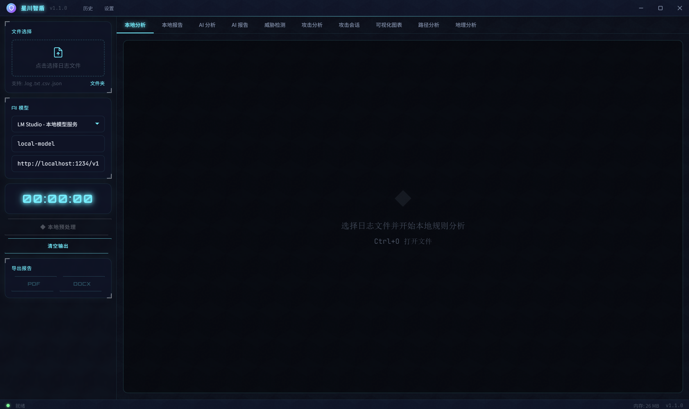

### `⬡` AI 分析过程
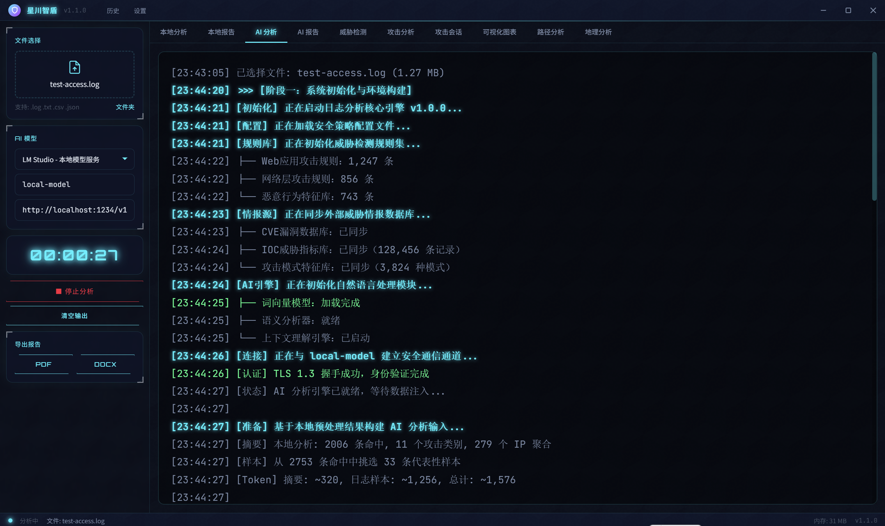

### `⬡` AI 安全分析报告
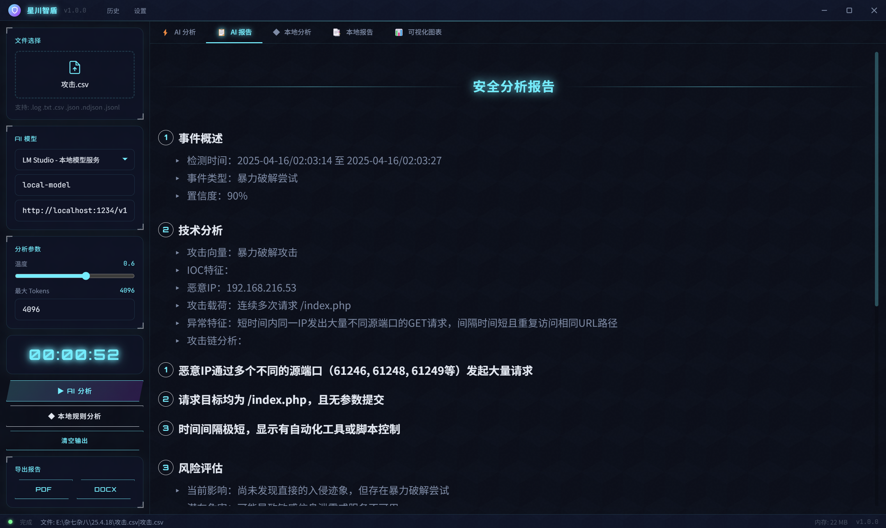

### `⬡` 本地规则分析
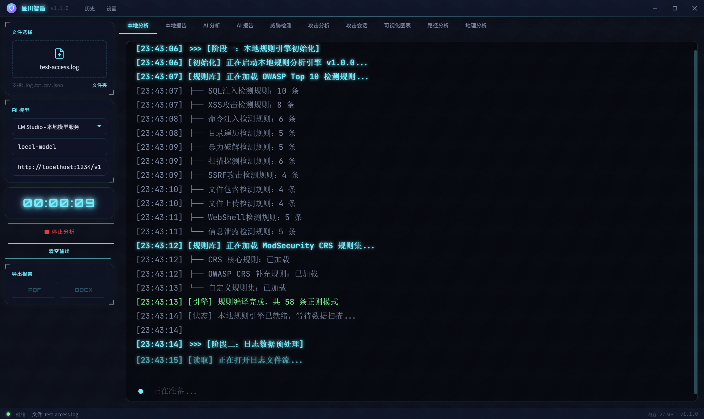

### `⬡` 本地分析报告
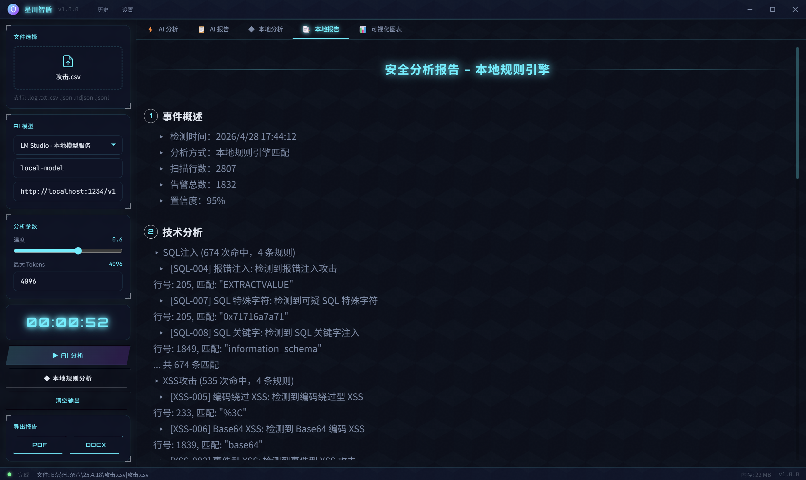

### `⬡` 攻击分析面板
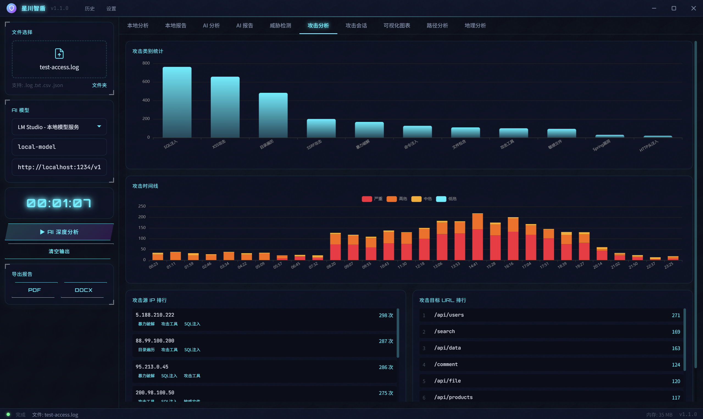

### `⬡` 威胁检测面板
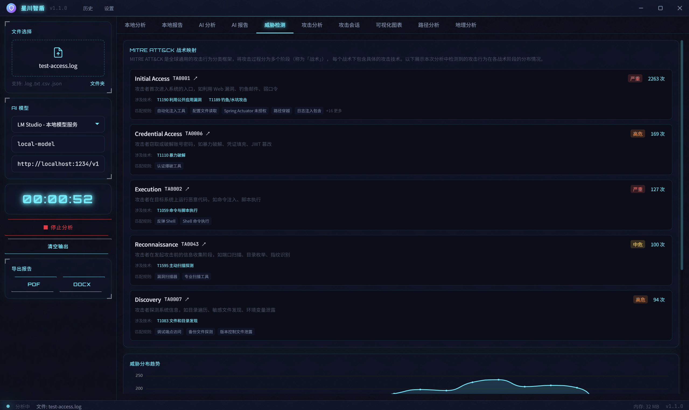

### `⬡` 攻击会话面板
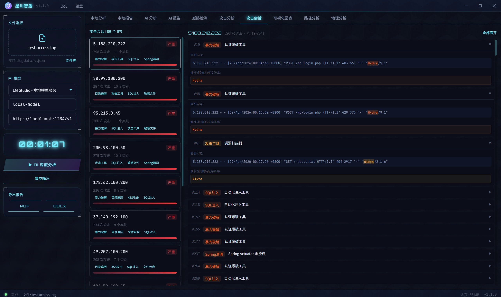

### `⬡` 可视化图表
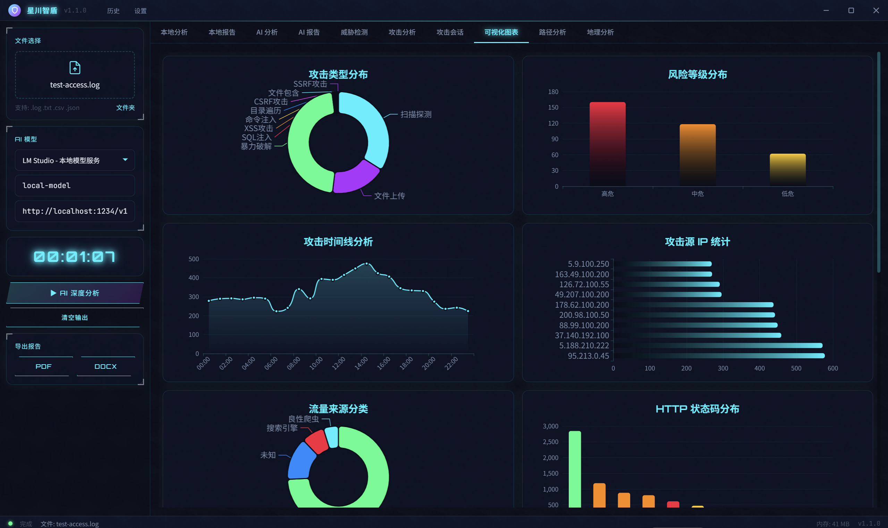

### `⬡` 路径分析面板
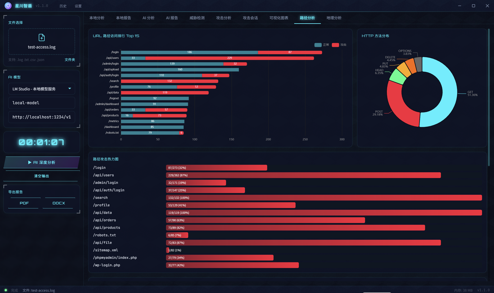

### `⬡` 地理分析面板
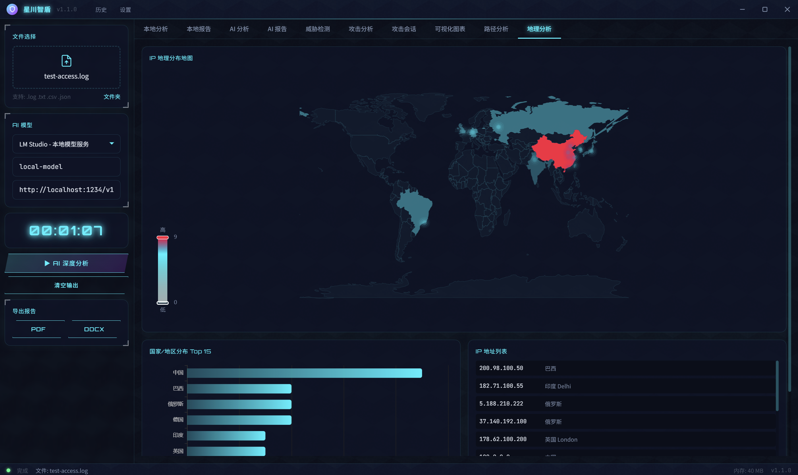

</div>

---

<!-- ═══ 快速上手 ═══ -->

<div align="center">

## `◈` 快速上手 `◈`

</div>

```
  ┌─────────────────────────────────────────────────────────────────┐
  │                                                                 │
  │  ① 下载安装     →  从 Releases 页面下载对应平台安装包          │
  │  ② 选择日志文件 →  支持 .log .txt .csv .json .ndjson 格式      │
  │  ③ 配置 AI 模型 →  选择提供商，填入 API Key（可选）            │
  │  ④ 开始分析                                                    │
  │     ├── AI 分析    →  深度语义分析，生成详细报告                │
  │     └── 本地分析   →  65+ 条规则离线检测，即时出结果            │
  │  ⑤ 查看报告      →  自动跳转到对应报告页面                     │
  │  ⑥ 导出报告      →  DOCX / PDF 两种格式                        │
  │  ⑦ 数据面板      →  威胁/攻击/会话/路径/地理 5 大分析          │
  │                                                                 │
  └─────────────────────────────────────────────────────────────────┘
```

### 支持的日志格式

| 格式 | 说明 | 示例 |
|:---:|:---|:---|
| **Apache / Nginx** | 标准 Combined Log Format | `192.168.1.1 - - [10/Oct/2024:13:55:36] "GET /index.html" 200` |
| **JSON** | 结构化 JSON 日志 | `{"ip":"192.168.1.1","method":"GET","path":"/api"}` |
| **CSV** | 逗号分隔值 | 自动检测列名和分隔符 |
| **NDJSON** | 每行一个 JSON 对象 | 适合大规模日志流 |
| **纯文本** | 任意文本格式 | 自动提取 IP、URL、状态码等关键字段 |

### 键盘快捷键

| 快捷键 | 功能 |
|:---:|:---|
| `Ctrl+O` | 打开日志文件 |
| `Ctrl+Enter` | 开始 AI 分析 |
| `Escape` | 停止分析 |
| `Ctrl+H` | 打开历史记录 |
| `Ctrl+,` | 打开设置 |
| `Ctrl+F` | 搜索报告内容 |

---

<!-- ═══ AI 提供商 ═══ -->

<div align="center">

## `◈` AI 分析引擎 `◈`

</div>

星川智盾支持 **8 大 AI 平台**，覆盖国内外主流大模型，可根据需求灵活选择：

<table>
<tr>
<td width="50%">

**云端 AI 服务**

| 提供商 | 默认模型 | 特点 |
|:---:|:---:|:---|
| **DeepSeek** | `deepseek-chat` | 性价比最高，推荐首选 |
| **通义千问** | `qwen-turbo` | 阿里云，中文理解强 |
| **智谱 AI** | `glm-4-flash` | 清华系，学术背景 |
| **Kimi** | `moonshot-v1-8k` | 长文本处理优秀 |
| **文心一言** | `ernie-speed-128k` | 百度系，速度快 |
| **OpenAI** | `gpt-4o-mini` | 国际通用 |

</td>
<td width="50%">

**本地部署方案**

| 提供商 | 默认模型 | 特点 |
|:---:|:---:|:---|
| **Ollama** | `qwen2.5:7b` | 完全离线，无需 API Key |
| **LM Studio** | `local-model` | GUI 管理，开箱即用 |

<br/>

> **本地部署** 无需 API Key，适合内网隔离环境和数据敏感场景。
> 安装 Ollama 或 LM Studio 后，星川智盾自动识别本地模型。

</td>
</tr>
</table>

**AI 分析特性：**
- 智能采样 — 按威胁评分优先选取高风险样本，Token 用量控制在 2 万以内
- 双引擎独立 — AI 分析和本地规则分析互不干扰，各自生成独立报告
- 中途停止 — 支持 AbortController 即时中断，不浪费 Token
- 详细错误提示 — API 调用失败时显示具体原因和排查建议

---

<!-- ═══ 本地规则引擎 ═══ -->

<div align="center">

## `◈` 本地规则引擎 `◈`

</div>

基于 **ModSecurity CRS v4** 和 **OWASP Top 10 2025** 标准，**130+ 条高置信度规则**覆盖 **30 个攻击类别**，离线可用，零延迟：

<table>
<tr>
<td width="50%">

| 类别 | 风险 | OWASP |
|:---|:---:|:---:|
| SQL 注入 (20条) | `🔴` 危急 | A03 |
| XSS 攻击 (15条) | `🔴` 危急 | A03 |
| 命令注入 (15条) | `🔴` 危急 | A03 |
| WebShell (8条) | `🔴` 危急 | A08 |
| 反序列化攻击 (5条) | `🔴` 危急 | A08 |
| 模板注入 SSTI (6条) | `🔴` 危急 | A03 |
| Log4j 注入 | `🔴` 危急 | A09 |
| Spring 漏洞 | `🔴` 危急 | A06 |
| SSRF 攻击 (6条) | `🔴` 危急 | A10 |
| 目录遍历 (5条) | `🔴` 危急 | A01 |
| 文件包含 | `🔴` 危急 | A03 |
| HTTP 请求走私 | `🔴` 危急 | A04 |
| HTTP 头注入 | `🔴` 危急 | A03 |
| JWT 攻击 | `🔴` 危急 | A02 |
| NoSQL 注入 | `🔴` 危急 | A03 |

</td>
<td width="50%">

| 类别 | 风险 | OWASP |
|:---|:---:|:---:|
| LDAP 注入 | `🔴` 危急 | A03 |
| XXE 注入 | `🔴` 危急 | A05 |
| PHP 代码注入 | `🔴` 危急 | A03 |
| Java 代码注入 | `🔴` 危急 | A03 |
| GraphQL 注入 | `🟠` 高危 | A03 |
| 原型污染 | `🔴` 危急 | A08 |
| 会话固定 | `🟠` 高危 | A07 |
| HTTP_PROXY 注入 | `🟠` 高危 | A10 |
| XML-RPC 滥用 | `🟠` 高危 | A05 |
| 缓存投毒 | `🟠` 高危 | A04 |
| HTTP 方法覆盖 | `🟡` 中危 | A07 |
| 敏感文件访问 (5条) | `🟠` 高危 | A01 |
| 攻击工具 (4条) | `🟠` 高危 | A05 |
| 信息泄露 (6条) | `🟡` 中危 | A05 |
| 暴力破解 / 爬虫 | `🟡` 中危 | A07 |

</td>
</tr>
</table>

**检测能力亮点：**

- **低误报率** — 所有模式使用词边界匹配，SQL 注入要求关键字组合而非单个关键字
- **MITRE ATT&CK 映射** — 每条规则自动关联攻击战术和技术，通俗化描述
- **CWE 漏洞关联** — 自动关联 CWE 编号，便于漏洞追踪和合规审计
- **GeoIP 地理定位** — 离线 IP 地理定位，攻击来源一目了然

---

<!-- ═══ 5大分析面板 ═══ -->

<div align="center">

## `◈` 5 大数据分析面板 `◈`

</div>

<table>
<tr>
<td align="center" width="20%">

**威胁检测**

MITRE ATT&CK 战术映射

CWE 漏洞关联 Top 10

威胁分布趋势图

</td>
<td align="center" width="20%">

**攻击会话**

按 IP 分组攻击序列

展开查看原始日志

高亮匹配内容

</td>
<td align="center" width="20%">

**路径分析**

URL 路径访问排行

攻击热力图

HTTP 方法分布

</td>
<td align="center" width="20%">

**地理分析**

GeoIP 世界地图

国家分布统计

ISP 运营商识别

</td>
<td align="center" width="20%">

**可视化图表**

10 种科技感图表

自适应字体缩放

攻击时间线分析

</td>
</tr>
</table>

---

<!-- ═══ 主题系统 ═══ -->

<div align="center">

## `◈` 7 种赛博朋克主题 `◈`

</div>

<div align="center">

| 主题 | 色调 | 说明 |
|:---:|:---:|:---|
| **Cyber** | `#00f0ff` 青 | 默认主题，经典赛博朋克 |
| **Neon** | `#ff003c` 红 | 高对比度，警报风格 |
| **Matrix** | `#00ff88` 绿 | 矩阵代码风格 |
| **Energy** | `#b44aff` 紫 | 能量紫，神秘感 |
| **Solar** | `#ffaa00` 橙 | 暖色调，日间使用 |
| **Ice** | `#0088ff` 蓝 | 冰蓝，冷静分析 |
| **Void** | `#666666` 灰 | 暗色系，减少干扰 |

</div>

---

<!-- ═══ 示例数据 ═══ -->

<div align="center">

## `◈` 示例数据 `◈`

</div>

项目内置示例日志文件 `samples/sample-access.log`，覆盖以下攻击场景，开箱即测：

| 攻击类型 | 示例 Payload | OWASP 分类 |
|:---|:---|:---:|
| SQL 注入 | `UNION SELECT`, 盲注, 时间盲注 | A03 |
| XSS 攻击 | 反射型, DOM 型, SVG 注入 | A03 |
| 目录遍历 | `../../etc/passwd` | A01 |
| 命令注入 | `; cat /etc/passwd` | A03 |
| SSRF 攻击 | 内网元数据, `file://` 协议 | A10 |
| WebShell | 蚁剑, 一句话木马 | A08 |
| 暴力破解 | Hydra, 字典攻击 | A07 |
| 扫描探测 | Nikto, sqlmap, Nmap | A05 |
| 正常流量 | 搜索引擎蜘蛛, 正常用户访问 | — |

---

<!-- ═══ 更新日志 ═══ -->

<div align="center">

## `◈` 更新日志 `◈`

</div>

### v1.7.0 (2026-04-30)

**规则引擎全面升级**
- 规则总数从 52 条扩展到 130+ 条，覆盖 30 个攻击类别
- 新增 12 个攻击类别：NoSQL 注入、LDAP 注入、XXE 注入、PHP 代码注入、Java 代码注入、GraphQL 注入、原型污染、会话固定、HTTP_PROXY 注入、XML-RPC 滥用、缓存投毒、HTTP 方法覆盖
- SQL 注入规则增强至 20 条，覆盖 MySQL/MSSQL/PostgreSQL/SQLite 特有语法、WAF 绕过、认证绕过等
- XSS 规则增强至 15 条，覆盖 CSS 表达式、HTML 实体绕过、mutation XSS、Cookie 窃取等
- 命令注入规则增强至 15 条，覆盖 Windows 命令、Base64 编码执行、Shellshock CVE-2014-6271 等
- 所有规则基于 OWASP CRS v4 标准，MITRE ATT&CK 和 CWE 自动映射更新至 2025 版

**CI/CD 修复**
- 修复 Linux 构建依赖缺失问题

### v1.6.0 (2026-04-30)

**跨平台支持**
- 新增 macOS (DMG) 和 Linux (AppImage) 安装包
- Windows / macOS / Linux 三平台全覆盖

**UX 优化**
- MITRE ATT&CK 战术卡片增加通俗描述、技术详情、外部链接
- 攻击会话详情可展开，高亮显示匹配内容
- 图表布局优化，流量来源分类移至更合理位置

**规则引擎**
- 修复攻击计数去重问题，避免同一行多次匹配导致数据异常

### v1.4.0

- 规则引擎全面重构，基于 OWASP CRS v4，移除 25+ 条高误报规则
- 攻击时间线改为实际时间戳，支持多种日志格式
- 新增 ScalingChart 组件，图表自适应字体缩放
- AI 分析优化：智能采样 + Token 控制 + 详细错误信息

### v1.3.0

- 字体大小设置扩展到数据面板
- 图表坐标系统随字体缩放自动调整

### v1.2.0

- AI 输入优化：发送分析摘要 + 小样本，控制在 2 万 Token 以内
- AI 失败时显示详细错误信息和排查建议

### v1.1.0

- 新增 5 大数据分析面板（威胁/攻击/会话/路径/地理）
- MITRE ATT&CK 战术映射 + 通俗化描述
- GeoIP 世界地图 + 国家分布

### v1.0.0

- 初始发布
- AI 智能分析 + 本地规则引擎双引擎
- 8 大 AI 平台支持
- DOCX / PDF 报告导出
- 7 种赛博朋克主题

---

<!-- ═══ 许可证 ═══ -->

<div align="center">

## `◈` 许可证 `◈`

本项目采用 **[GNU Affero General Public License v3.0 (AGPL-3.0)](LICENSE)** 许可证

**核心条款：**
衍生作品必须开源 · 网络服务（SaaS）必须提供源代码 · 禁止闭源分发

如需商业授权或许可证豁免，请联系项目维护者。

</div>

---

<!-- ═══ Footer ═══ -->

<div align="center">


**星川智盾** `v1.7.0` · 星川智盾安全团队

</div>
